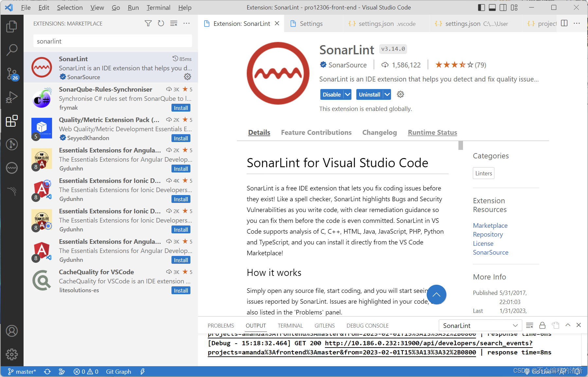
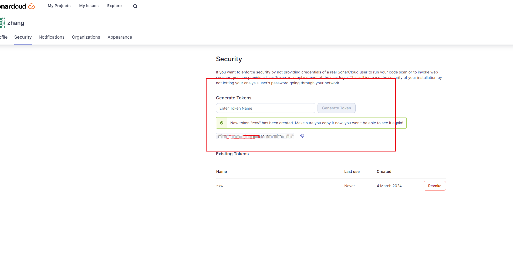
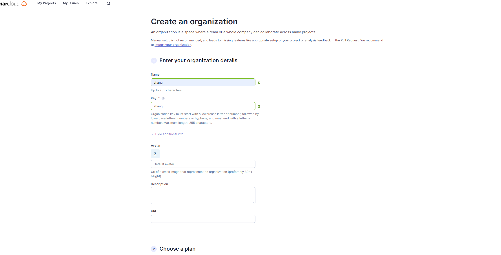
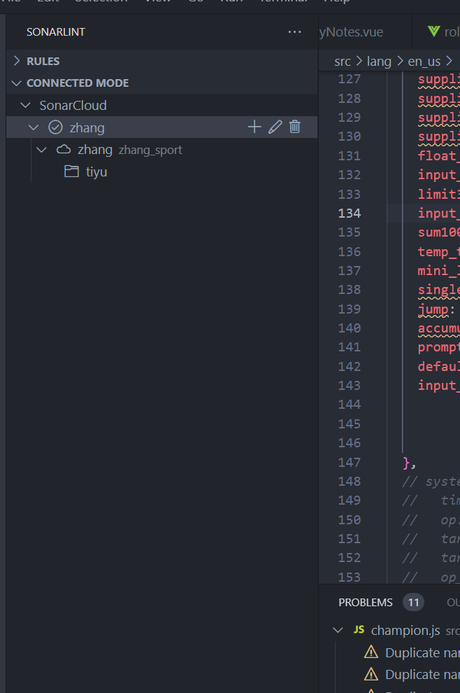

#    VS Code 配置SonarLint 

团队使用**sonarqube**进行代码的风险检测，通过**Jenkins**定时跑任务的方式，为了更好地及时相应代码的Bugs以及漏洞的修改，本文主要介绍在vscode中如果通过插件配置及时响应sonarqube线上代码的问题

前提：

- 团队中or个人已经部署了sonarqube，启动sonar server服务。记住sonar server服务中配置好的`projectKey`，后续会用到
- 本文主要使用的是vscode的`SonarLint`插件

- 官网地址  https://sonarcloud.io/account/security  

## sonarlint安装使用

1. 点击 VSCode 左侧扩展（Extensions）按钮打开扩展市场
2.  在扩展市场中搜索 **sonarLint**，选择第一个选

##   获取Generate Token  （ https://sonarcloud.io/account/security ）

先登录自己的`sonarQube` => 点击自己的头像 => 进入myAccount => 进入Security一栏 => 写一个自己定义的token name => 复制生成的token并保存好。 注意这个token只能生成时看到，后面就看不到了，所以要保存好，配置时要用。

a5b5eb545561e1d7690e8555e5d4838d5de55bb6

#### 关联组织

#### 关联成功

#### 操作视频 

https://www.sonarsource.com/products/sonarlint/features/connected-mode/

